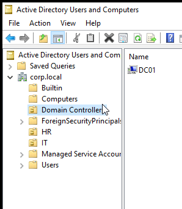
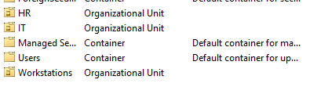
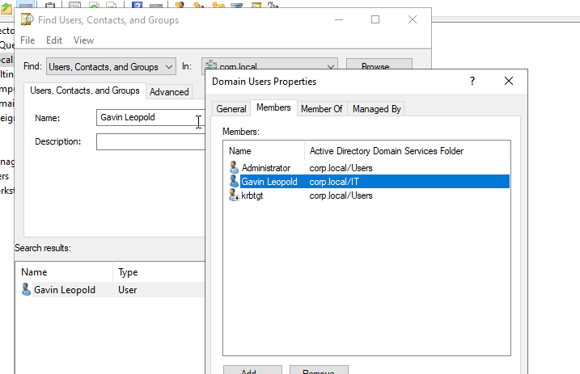
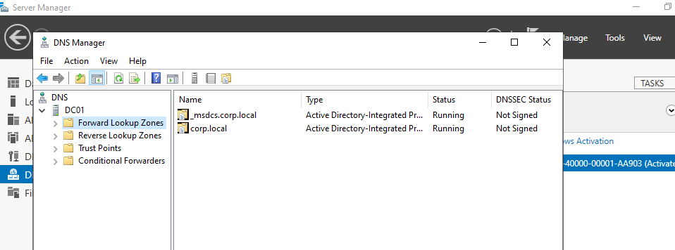
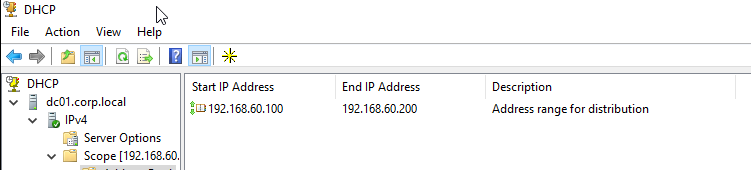
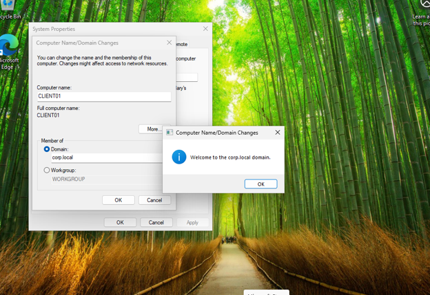
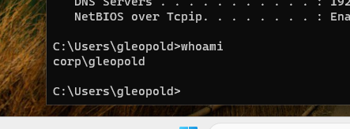

# Active Directory Home Lab

## Overview

This project demonstrates the deployment of a Windows Server 2022 Active Directory environment using VMware Workstation.

The main objective was to configure Active Directory Domain Services (AD DS), DNS, and DHCP while managing domain users and joining Windows 11 clients to the domain.

## Technologies

* Windows Server 2022
* Windows 11 Pro
* VMware Workstation Pro
* Active Directory Domain Services (AD DS)
* DNS
* DHCP

## Topology

```text
VMnet1
│
├── DC01
│   ├── Active Directory
│   ├── DNS
│   └── DHCP
│
└── CLIENT01
```

### Network Information

| Device   | IP Address    |
| -------- | ------------- |
| DC01     | 192.168.60.10 |
| CLIENT01 | DHCP Assigned |
| Domain   | corp.local    |

## Active Directory Deployment

Installed Active Directory Domain Services and promoted DC01 to a Domain Controller for the `corp.local` domain.



## Organizational Units

Created Organizational Units for administrative organization.

* IT
* HR
* Workstations



## User Management

Created domain user accounts and organized them within Active Directory.

Example:

* gleopold



## DNS Configuration

Verified DNS zone creation and Active Directory integration.



## DHCP Configuration

Configured DHCP scope:

```text
192.168.60.100 - 192.168.60.200
```

Verified clients received addresses automatically from DC01.



## Client Configuration

Installed Windows 11 Pro and joined CLIENT01 to the domain.

### Domain Join

Successfully joined CLIENT01 to:

```text
corp.local
```



### Active Directory Computer Object

Verified CLIENT01 was added to Active Directory.



## Authentication Verification

Verified successful domain authentication using:

```text
CORP\gleopold
```


## Skills Demonstrated

* Active Directory Administration
* DNS Configuration
* DHCP Configuration
* Domain Controller Deployment
* User and Computer Management
* Organizational Unit Management
* Windows Server Administration
* Domain Join Troubleshooting
* VMware Virtualization
* Network Services Troubleshooting
